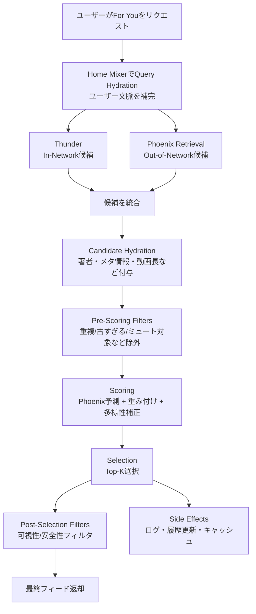
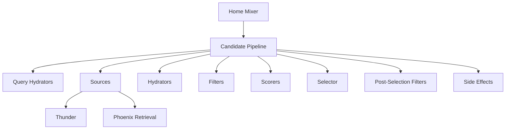

# X「For You」アルゴリズム図解（日本語）

このドキュメントは、このリポジトリにある For You 推薦処理の全体像を **図で直感的に理解する** ための簡易ガイドです。  
中心となる考え方は「**候補を集める → 不要を落とす → スコア化して並べる**」です。

---

## 1. 全体フロー



---

## 2. スコアリングの考え方

```mermaid
flowchart LR
    A[候補投稿] --> B[Phoenixが行動確率を予測<br/>like/reply/repost/click/...]
    B --> C[重み付き合成<br/>Final = Σ weight × P(action)]
    C --> D[著者多様性補正<br/>同一著者の連続露出を減衰]
    D --> E[OON補正<br/>Out-of-Network係数調整]
    E --> F[最終スコア]
```

- 正の行動（like/repost など）は加点方向
- 負の行動（not interested/block/report など）は減点方向
- その後、著者の偏りを抑える補正と OON 補正を適用

---

## 3. 主要コンポーネントの役割



- **Home Mixer**: 全体オーケストレーション
- **Thunder**: フォロー中由来の新鮮な候補
- **Phoenix Retrieval/Ranking**: ML による候補発見と順位付け
- **Candidate Pipeline**: 各ステージを共通フレームワークとして実行

---

## 4. 処理順（簡易チェックリスト）

1. Query Hydration  
2. Candidate Sourcing（Thunder + Phoenix など）  
3. Candidate Hydration  
4. Pre-Scoring Filtering  
5. Scoring（予測・重み付け・補正）  
6. Selection（Top-K）  
7. Post-Selection Filtering  
8. Side Effects（履歴/ログ更新）

